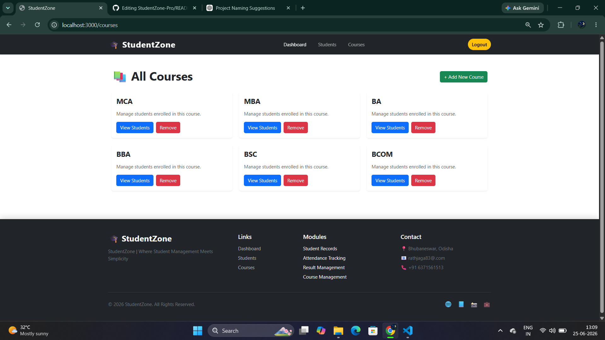
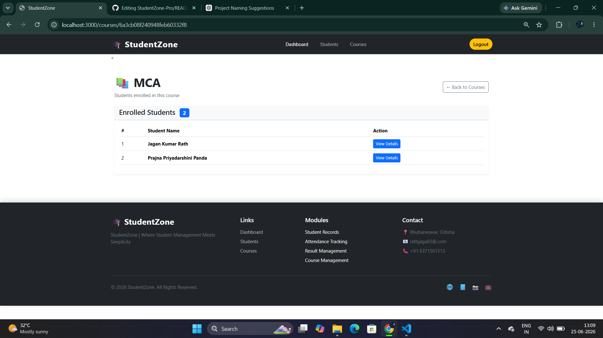
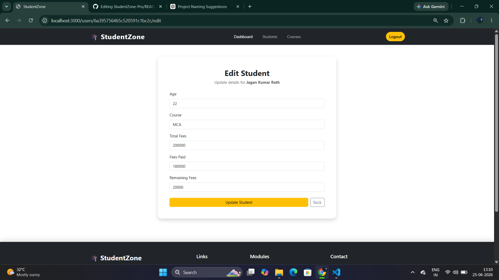

# 🎓 StudentZone Pro

A modern Student Management System built with the MERN Stack.

## 📌 Overview

StudentZone Pro helps educational institutions manage student records efficiently. It provides a centralized platform for storing and managing academic information.

## ✨ Features

- 🔐 Authentication & Authorization
- 👨‍🎓 Student Management
- ➕ Add New Students
- ✏️ Update Student Records
- ❌ Delete Student Records
- 🔍 View Student Details
- 📱 Responsive Bootstrap UI
- 📊 Dashboard Interface

## 🛠️ Tech Stack

### Frontend
- EJS
- Bootstrap 5
- HTML5
- CSS3

### Backend
- Node.js
- Express.js

### Database
- MongoDB
- Mongoose

### Authentication
- Passport.js
- Passport Local Mongoose
- Express Session

## 📂 Project Structure

```bash
StudentZone-Pro/
│
├── database/
├── model/
├── public/
├── routes/
│   ├── admin.js
│   └── user.js
├── views/
│   ├── listings/
│   ├── users/
│   └── includes/
├── middleware.js
├── index.js
├── package.json
└── package-lock.json
```
## 🚀 Installation

```bash
git clone https://github.com/yourusername/StudentZone-Pro.git
```

```bash
cd StudentZone-Pro
```

```bash
npm install
```

```bash
npm start
```

## 📸 Screenshots

### Dashboard


### Login Page


### Signup Page


### Student List


### Add Student Form


### Courses Page


### Add Courses page


### Course Student List 


### Edit Student Page



## 🔮 Future Enhancements

- Attendance Management
- Result Management
- Faculty Management
- Fee Management
- Notice Board
- Export Reports (PDF/Excel)

## 🤝 Contributing

Contributions are welcome. Feel free to fork the repository and submit pull requests.

## 📄 License

This project is licensed under the MIT License.

---

Developed with ❤️ using Node.js, Express.js, MongoDB, and Bootstrap.
